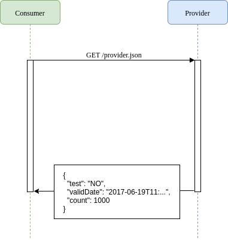

# Example JVM project for the Pact workshop

This project has 3 components, a consumer project and two service providers, one Dropwizard and one
Springboot service that the consumer will interaction with.

## Step 1 - Simple Consumer calling Provider

Given we have a client that needs to make a HTTP GET request to a provider service, and requires a response in JSON format.


The client is quite simple and looks like this

*consumer/src/main/groovy/au/com/dius/pactworkshop/consumer/Client.groovy:*

```groovy
class Client {

  def loadProviderJson() {
    def http = new RESTClient('http://localhost:8080')
    def response = http.get(path: '/provider.json', query: [validDate: LocalDateTime.now().toString()])
    if (response.success) {
      response.data
    }
  }
}
```

and the dropwizard provider resource

*providers/dropwizard-provider/src/main/groovy/au/com/dius/pactworkshop/dropwizardprovider/RootResource.groovy:*

```groovy
@Path("/provider.json")
@Produces(MediaType.APPLICATION_JSON)
class RootResource {

  @GET
  Map providerJson(@QueryParam("validDate") Optional<String> validDate) {
    def valid_time = LocalDateTime.parse(validDate.get())
    [
      test: 'NO',
      validDate: LocalDateTime.now().toString(),
      count: 1000
    ]
  }

}
```

The springboot provider controller is similar

*providers/springboot-provider/src/main/groovy/au/com/dius/pactworkshop/springbootprovider/RootController.groovy:*

```groovy
@RestController
class RootController {

  @RequestMapping("/provider.json")
  Map providerJson(@RequestParam(required = false) String validDate) {
    def validTime = LocalDateTime.parse(validDate)
    [
      test: 'NO',
      validDate: LocalDateTime.now().toString(),
      count: 1000
    ]
  }

}
```

This providers expects a `validDate` parameter in HTTP date format, and then return some simple json back.



Running the client with either provider works nicely.

```
$ ./gradlew :consumer:run
Starting a Gradle Daemon, 4 stopped Daemons could not be reused, use --status for details
:consumer:compileJava UP-TO-DATE
:consumer:compileGroovy UP-TO-DATE
:consumer:processResources UP-TO-DATE
:consumer:classes UP-TO-DATE
:consumer:run
[test:NO, validDate:2017-01-27T11:49:04.131, count:1000]

BUILD SUCCESSFUL
```
